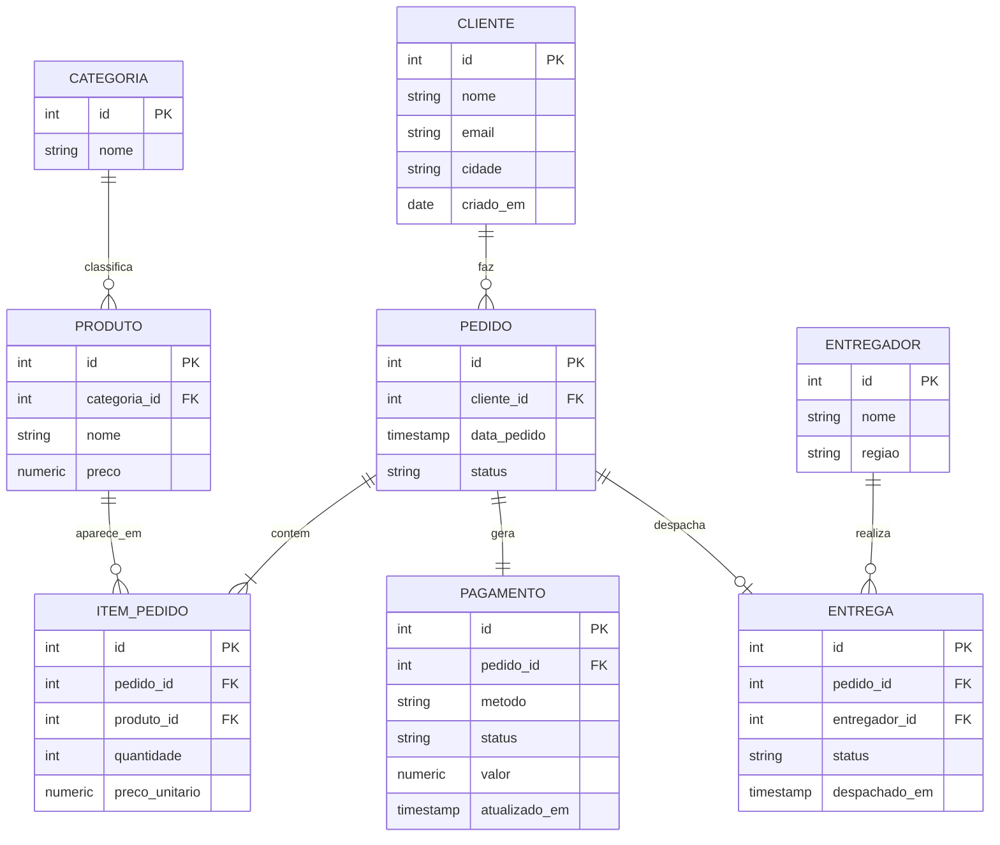

# Capítulo 00 — Modelagem transacional (OLTP) 🟢

> **De onde viemos:** do começo de tudo. Antes de mover ou transformar um único dado, é preciso entender **como o dado nasce**. Toda a jornada parte daqui — da origem transacional.

## Por que este é o capítulo zero

Engenharia de dados não começa no pipeline; começa em **entender o modelo da origem**. Você não consegue extrair, nem confiar, nem transformar um dado cujo schema você não compreende. Este capítulo desenha, do zero, o banco transacional que será a fonte dos capítulos seguintes — e ensina *por que* ele é modelado do jeito que é.

## Cenário de negócio

A **NuvemStore** (o e-commerce que acompanha toda a trilha) precisa de um banco que sustente o site: registrar clientes, produtos, pedidos e itens de pedido com **escritas rápidas, consistentes e sem redundância**. Esse é o trabalho de um modelo **OLTP** (Online Transaction Processing).

> 📋 O domínio completo — negócio, fontes e necessidades futuras — está no [`COMPANY.md`](../COMPANY.md). As decisões de modelagem abaixo derivam diretamente dele: por exemplo, separar **pagamento** como entidade própria existe para viabilizar o CDC de fraude do cap. 11.

## O modelo (normalizado)

As três entidades extras — **pagamento**, **entrega** e **entregador** — existem para suportar capítulos futuros: `pagamento` (com `atualizado_em`) é a fonte do **CDC de fraude** (cap. 11), e `entrega`/`entregador` ancoram os **eventos de GPS** do streaming (cap. 12). Modelar a origem já contemplando isso é o que diferencia uma plataforma planejada de uma remendada.

> Há também um ERD gerado por código em [`diagrams/architecture.py`](./diagrams/architecture.py), consistente com os demais diagramas do repo.
>
> O mesmo modelo também está descrito **as-code** em [`modeling/nuvemstore_oltp.dbml`](./modeling/nuvemstore_oltp.dbml) (DBML). Cole o arquivo em [dbdiagram.io](https://dbdiagram.io) para ver o ERD renderizado, ou rode `npx @dbml/cli@latest sql modeling/nuvemstore_oltp.dbml --postgres` para gerar o DDL a partir dele — o diagrama e o `schema.sql` partem da mesma fonte e não divergem.

## O seeder — a aplicação que dá vida à origem

O schema acima é só o esqueleto. Quem o preenche é o **seeder** (`seed/seed.py`): ele **simula a aplicação da NuvemStore**, gerando clientes, produtos, pedidos, pagamentos e entregas como se o site estivesse operando. Sem ele, a plataforma inteira (warehouse, lake, streaming, ML) não teria dado para mover — por isso o seeder é um **componente de primeira classe** desta trilha, não um detalhe de setup. Todos os capítulos seguintes consomem o que ele produz; eles só dizem "a aplicação continua gerando pedidos" e voltam aqui.

O que o seeder faz de propósito:

- **Gera dados coerentes, não aleatórios soltos.** Um pedido `pago` tem pagamento `pago` e pode ter entrega; um `cancelado` tem pagamento `recusado` e nenhuma entrega. As relações respeitam as FKs e os `CHECK` do schema.
- **É determinístico e idempotente.** A seed fixa (`42`) e o `SEED_RESET=true` garantem que rodar duas vezes produz exatamente o mesmo banco — reprodutibilidade é pré-requisito para qualquer pipeline confiável.
- **É parametrizável por volume.** O volume é controlado por variáveis de ambiente (`SEED_CLIENTES`, `SEED_PEDIDOS`), porque capítulos diferentes têm necessidades diferentes (ver abaixo).

**Cenários e o caso especial da fraude.** Para a maior parte da trilha, o volume default (250 clientes / 1.200 pedidos) basta — é rápido de subir e fácil de inspecionar. O **capítulo 13 (ML de fraude)** é a exceção: um detector precisa de massa suficiente na classe minoritária, então ele sobe o seeder em **modo de volume maior** (dezenas de milhares de pedidos) e ativa a **injeção de comportamentos suspeitos** (`SEED_FRAUDE=true`): rajada de pagamentos do mesmo cliente em minutos, ticket muito acima do histórico do cliente, e método de risco em cliente recém-criado.

O detalhe que faz o cap 13 ter sentido: **o seeder não rotula fraude na hora**. Ele gera o *comportamento*; a confirmação (`status` final / chargeback) só aparece **com atraso** — exatamente como no mundo real, onde o banco confirma a fraude semanas depois. Isso é o que torna possível ensinar *point-in-time correctness* e evitar *label leakage*: no instante do pagamento, o label ainda não existe. Se o seeder marcasse `fraude=true` direto na linha, não haveria feature engineering — o modelo "leria a resposta". (Ver o GUIDE do [cap 13](../13-base-ml-fraude/GUIDE.md).)

> Hoje o seeder roda **on-demand** (um job que popula e encerra). Em capítulos que precisam de fluxo contínuo — CDC (cap 11) e streaming (cap 12) — ele opera em modo de geração incremental, emitindo novos pedidos/eventos ao longo do tempo em vez de uma carga única.

## Conceitos

**OLTP — Online Transaction Processing.** Banco otimizado para muitas transações pequenas e concorrentes (inserir um pedido, atualizar um status). Prioriza **integridade e velocidade de escrita**, não análise.

**Normalização (1FN, 2FN, 3FN).** O processo de organizar o schema para **eliminar redundância** e evitar anomalias de atualização:

- **1FN:** cada coluna é atômica (sem listas dentro de uma célula); existe chave primária.
- **2FN:** estando em 1FN, todo atributo não-chave depende da chave *inteira* (relevante em chaves compostas).
- **3FN:** estando em 2FN, nenhum atributo não-chave depende de outro atributo não-chave (sem dependências transitivas).

O resultado: o nome da categoria mora **só** na tabela `categoria`, não repetido em cada produto. Mudar o nome é um `UPDATE` numa linha — não em milhões.

**Chaves primárias e estrangeiras.** A PK identifica unicamente uma linha; a FK referencia a PK de outra tabela, criando o relacionamento e garantindo **integridade referencial** (não existe pedido sem cliente válido).

**Cardinalidade dos relacionamentos.** Um cliente faz *vários* pedidos (1:N); um pedido contém *vários* itens (1:N); um item liga *um* pedido a *um* produto. Saber ler e desenhar isso é o alfabeto da modelagem.

**Por que o engenheiro de dados precisa disso.** A origem normalizada é ótima para escrever, mas **péssima para analisar** — uma pergunta de negócio simples ("receita por categoria") exige juntar 4 ou 5 tabelas. Essa dor é exatamente o que motiva a modelagem dimensional do próximo capítulo: o engenheiro de dados é quem faz a **ponte entre o modelo de escrita e o modelo de leitura**.

> Aprofundamento técnico (ACID, MVCC, WAL, alternativas ao Postgres) em [`TECHNICAL.md`](./TECHNICAL.md).

## Como executar

Este README descreve o *porquê* do modelo. Para subir e usar a origem — comandos, saída esperada e validações — veja o **[RUNBOOK.md](./RUNBOOK.md)**.

> Este capítulo é a **fundação compartilhada**: não tem `docker-compose.yml` próprio. O schema e o seeder são reaproveitados pelos capítulos seguintes, e a origem sobe pela primeira vez no [capítulo 02](../02-dimensional-no-oltp).

## A dor que sobra

O modelo é limpo para escrever, mas responder qualquer pergunta analítica exige joins pesados e lentos — inviável em escala e hostil para quem só quer um número. **Precisamos de um modelo desenhado para ler.** → [Capítulo 01: Modelagem dimensional](../01-modelagem-dimensional).
