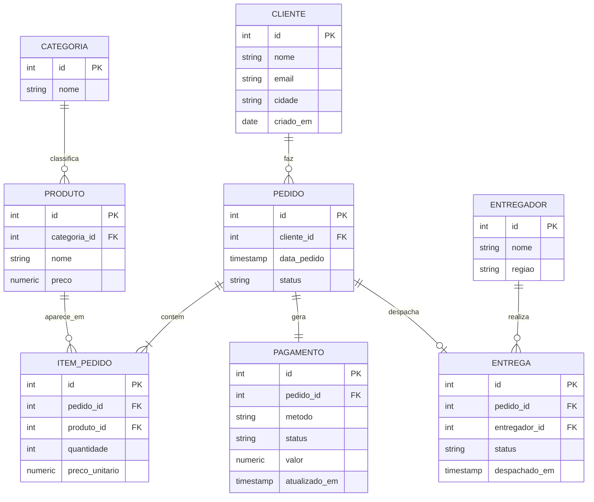

# Capítulo 00 — Modelagem transacional (OLTP) 🟢

> **De onde viemos:** do começo de tudo. Antes de mover ou transformar um único dado, é preciso entender **como o dado nasce**. Toda a jornada parte daqui — da origem transacional.

## Por que este é o capítulo zero

Engenharia de dados não começa no pipeline; começa em **entender o modelo da origem**. Você não consegue extrair, nem confiar, nem transformar um dado cujo schema você não compreende. Este capítulo desenha, do zero, o banco transacional que será a fonte dos capítulos seguintes — e ensina *por que* ele é modelado do jeito que é.

## Cenário de negócio

A **NuvemStore** (o e-commerce que acompanha toda a trilha) precisa de um banco que sustente o site: registrar clientes, produtos, pedidos e itens de pedido com **escritas rápidas, consistentes e sem redundância**. Esse é o trabalho de um modelo **OLTP** (Online Transaction Processing).

> 📋 O domínio completo — negócio, fontes e necessidades futuras — está no [`COMPANY.md`](../COMPANY.md). As decisões de modelagem abaixo derivam diretamente dele: por exemplo, separar **pagamento** como entidade própria existe para viabilizar o CDC de fraude do cap. 10.

## O modelo (normalizado)

As três entidades extras — **pagamento**, **entrega** e **entregador** — existem para suportar capítulos futuros: `pagamento` (com `atualizado_em`) é a fonte do **CDC de fraude** (cap. 10), e `entrega`/`entregador` ancoram os **eventos de GPS** do streaming (cap. 11). Modelar a origem já contemplando isso é o que diferencia uma plataforma planejada de uma remendada.

> Há também um ERD gerado por código em [`diagrams/architecture.py`](./diagrams/architecture.py), consistente com os demais diagramas do repo.

## Conceitos

**OLTP — Online Transaction Processing.** Banco otimizado para muitas transações pequenas e concorrentes (inserir um pedido, atualizar um status). Prioriza **integridade e velocidade de escrita**, não análise.

**Normalização (1FN, 2FN, 3FN).** O processo de organizar o schema para **eliminar redundância** e evitar anomalias de atualização:

- **1FN:** cada coluna é atômica (sem listas dentro de uma célula); existe chave primária.
- **2FN:** estando em 1FN, todo atributo não-chave depende da chave *inteira* (relevante em chaves compostas).
- **3FN:** estando em 2FN, nenhum atributo não-chave depende de outro atributo não-chave (sem dependências transitivas).

O resultado: o nome da categoria mora **só** na tabela `categoria`, não repetido em cada produto. Mudar o nome é um `UPDATE` numa linha — não em milhões.

**Chaves primárias e estrangeiras.** A PK identifica unicamente uma linha; a FK referencia a PK de outra tabela, criando o relacionamento e garantindo **integridade referencial** (não existe pedido sem cliente válido).

**Cardinalidade dos relacionamentos.** Um cliente faz *vários* pedidos (1:N); um pedido contém *vários* itens (1:N); um item liga *um* pedido a *um* produto. Saber ler e desenhar isso é o alfabeto da modelagem.

**Por que o engenheiro de dados precisa disso.** A origem normalizada é ótima para escrever, mas **péssima para analisar** — uma pergunta de negócio simples ("receita por categoria") exige juntar 4 ou 5 tabelas. Essa dor é exatamente o que motiva a modelagem dimensional do próximo capítulo: o engenheiro de dados é quem faz a **ponte entre o modelo de escrita e o modelo de leitura**.

## Implementação

- [x] `ddl/schema.sql` — `CREATE TABLE` das entidades transacionais com PKs, FKs e constraints.
- [x] `seed/seed.py` — seeder idempotente com Faker para popular a origem usada pelos capítulos seguintes.
- [x] `diagrams/architecture.py` — ERD gerado por código.

## A dor que sobra

O modelo é limpo para escrever, mas responder qualquer pergunta analítica exige joins pesados e lentos — inviável em escala e hostil para quem só quer um número. **Precisamos de um modelo desenhado para ler.** → Capítulo 01: Modelagem dimensional.
