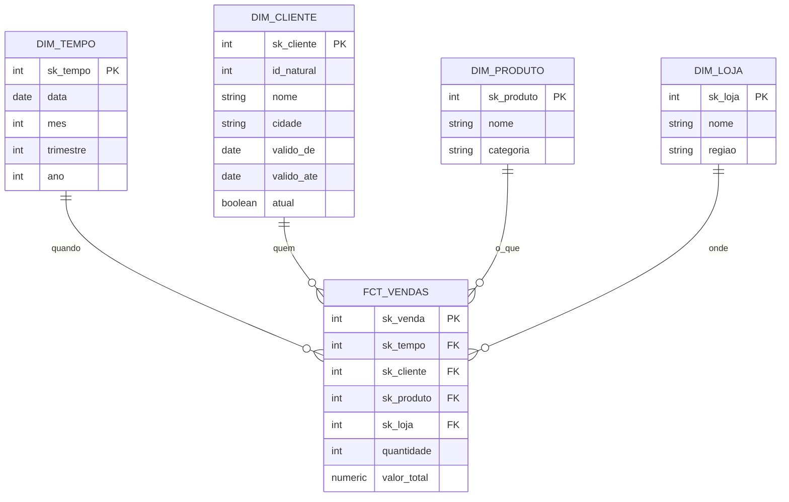

# Capítulo 01 — Modelagem dimensional (OLAP) 🟢

> **De onde viemos:** no Capítulo 00 desenhamos um banco transacional normalizado — ótimo para escrever, mas hostil para analisar (uma pergunta simples exige juntar 4–5 tabelas). Agora desenhamos o modelo oposto: feito para **ler**.

## Cenário de negócio

O time de analytics da **NuvemStore** quer responder, rápido: *"receita por categoria, por região, por mês"*, *"qual o ticket médio por trimestre?"*. No modelo OLTP normalizado isso é lento e cheio de joins. A solução é um **modelo dimensional** — desenhado para análise, não para transação.

> 📋 As dimensões e o grão aqui escolhidos atendem necessidades já mapeadas no [`COMPANY.md`](../COMPANY.md) — ex.: a dimensão cliente usa **SCD Tipo 2** porque o negócio precisa do histórico de mudanças (cliente que troca de cidade), e há particionamento por data pensando no tiering de storage do cap. 09.

## O modelo (star schema)

> ERD gerado por código em [`diagrams/architecture.py`](./diagrams/architecture.py).

## Por que desnormalizar (de propósito)

No Capítulo 00 normalizamos para **eliminar** redundância. Aqui fazemos o **oposto**: a `dim_produto` já traz a categoria embutida (sem tabela separada). Isso é intencional — em análise, **menos joins = consultas mais rápidas e simples**. Trocamos pureza de escrita por velocidade de leitura. Entender que essa é uma decisão *consciente*, não um erro, é o coração da modelagem dimensional.

## Conceitos

**OLAP e o star schema.** Um modelo dimensional organiza os dados em uma tabela **fato** central (os eventos mensuráveis — uma venda) cercada por tabelas **dimensão** (os contextos — quem, o quê, quando, onde). O formato visual de estrela dá o nome.

**Fato vs dimensão.** O *fato* guarda as **métricas** (quantidade, valor) e as chaves para as dimensões. A *dimensão* guarda os **atributos descritivos** pelos quais você filtra e agrupa (categoria, região, mês). "Receita (fato) por categoria (dimensão)".

**Grão (grain).** A definição mais importante do modelo: *o que uma linha da tabela fato representa?* Aqui, "um item vendido em uma venda". Definir o grão errado (ou misturar grãos) é a causa nº1 de modelos dimensionais quebrados.

**Surrogate keys.** A fato não usa a chave natural da origem (ex: `produto_id` do OLTP), e sim uma **chave artificial** (`sk_produto`) gerada no warehouse. Isso desacopla o warehouse da origem e é o que viabiliza o SCD Tipo 2.

**SCD — Slowly Changing Dimensions.** Atributos de dimensão mudam ao longo do tempo (um cliente muda de cidade). *Tipo 1* sobrescreve (perde histórico). *Tipo 2* cria uma nova versão da linha com `valido_de`/`valido_ate`/`atual`, **preservando o histórico** — assim uma venda antiga continua atribuída à cidade que o cliente tinha *na época*. Dominar SCD2 é um divisor de águas em entrevista.

**Star schema vs snowflake.** Se você normalizar as dimensões (categoria numa tabela à parte de produto), o star vira *snowflake*. Mais normalizado, menos redundante — porém mais joins. O star é geralmente preferido em BI pela simplicidade e performance.

**Kimball vs Inmon.** Duas escolas de DW. *Kimball* (bottom-up, data marts dimensionais) é o que seguimos aqui — pragmático e orientado a consulta. *Inmon* (top-up, warehouse normalizado corporativo) é mais centralizado. Saber que existem as duas abordagens mostra maturidade.

> Aprofundamento técnico (Kimball vs Inmon, SCD em profundidade, agregações) em [`TECHNICAL.md`](./TECHNICAL.md).

## Como executar

Este capítulo é **de modelagem** — não sobe um ambiente próprio; o star schema é materializado a partir do cap. 02 (no mesmo OLTP) e do cap. 03 (warehouse dedicado). O **[RUNBOOK.md](./RUNBOOK.md)** mostra como ver o modelo materializado (aponta para os caps. 02/03).

## A dor que sobra

Temos o modelo de origem (cap. 00) e o modelo analítico (cap. 01) desenhados. Mas eles são só **schemas** — ainda falta materializar esse desenho em um ambiente. → [Capítulo 02: dimensional no mesmo OLTP](../02-dimensional-no-oltp).
