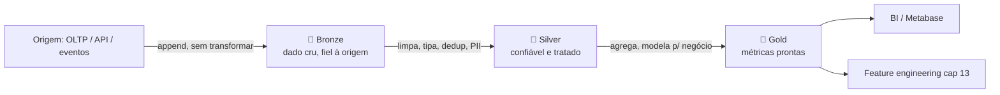

# Cap. 10 — Lakehouse Medallion: Delta Lake sobre o data lake

> **Aula deste capítulo.** Aqui você aprende o *porquê* de cada conceito, com exemplos trabalhados e o raciocínio de design. O código completo e copiável está no **[SOLUTION.md](./SOLUTION.md)**; os internals das ferramentas (formato do log, comparação com Iceberg/Hudi, tuning) estão no **[TECHNICAL.md](./TECHNICAL.md)**.

## O problema que este capítulo resolve

No capítulo 09 movemos o data lake para object storage (MinIO/S3): ganhamos escala e custo baixo. Mas um lake de arquivos soltos é **frágil**. Um exemplo concreto do que dá errado:

> Um job Spark começa a reescrever a tabela `entregas` (1.000 arquivos Parquet). Ele apaga 600, grava 350 novos e **falha** (estourou memória). A tabela agora tem 400 arquivos antigos + 350 novos = um estado que nunca existiu de verdade. Qualquer dashboard que ler nesse momento mostra números errados, e ninguém percebe.

Arquivos soltos no S3 não têm: **transação** (a escrita acima deveria ser tudo-ou-nada), **schema enforcement** (nada impede gravar uma coluna `preco` como texto em vez de número), **histórico** (não dá para voltar à versão de ontem), nem **upsert eficiente** (atualizar 1 linha exige reescrever o arquivo todo).

O **lakehouse** resolve isso: mantém os arquivos Parquet baratos do lake, mas adiciona um **log de transações** por cima que dá as garantias de um warehouse. Neste capítulo usamos **Delta Lake**.

## Pré-requisitos

- **Capítulo anterior:** 09 concluído (dados no MinIO/S3, Trino federando queries).
- **Conceitos que você já deve ter:** Parquet (cap 08), schema-on-read (cap 08), idempotência (caps 00, 04).
- **Docker:** versão 24+ com Docker Compose.

---

## Conceitos fundamentais

### 1. O que é um lakehouse — e por que ele existe

Antes existiam dois mundos separados:

| | Data Warehouse | Data Lake |
|---|---|---|
| Storage | caro, proprietário | barato, arquivos abertos (S3) |
| Garantias | ACID, schema, transações | nenhuma — "amontoado de arquivos" |
| Dados | só estruturado/tipado | qualquer formato |
| Risco | escala cara | virar *data swamp* (pântano de dados) |

O **lakehouse** é a tentativa de ter o melhor dos dois: **storage de lake + garantias de warehouse**. Não é um produto novo — é um *formato de tabela* (Delta Lake, Apache Iceberg, Apache Hudi) que se coloca por cima dos arquivos Parquet e adiciona um log transacional.

**O que está sendo usado neste capítulo:** Delta Lake, porque é o mais simples de demonstrar com Spark e o mais direto para mostrar ACID/time travel/MERGE. (Iceberg e Hudi resolvem o mesmo problema com trade-offs diferentes — ver TECHNICAL.)

### 2. Delta Lake: como ACID acontece sobre arquivos imutáveis

A pergunta-chave: *arquivos no S3 são imutáveis e não têm "transação" — como o Delta consegue ACID?*

A resposta é o **`_delta_log/`**. Uma tabela Delta não é só os Parquets; é os Parquets **+ um log de commits** ao lado:

```
s3a://datalake/silver/entregas/
├── _delta_log/
│   ├── 00000000000000000000.json   ← commit 0 (versão 0)
│   ├── 00000000000000000001.json   ← commit 1 (versão 1)
│   └── 00000000000000000002.json   ← commit 2 (versão 2 = atual)
├── part-0001.snappy.parquet
├── part-0002.snappy.parquet
└── part-0003.snappy.parquet
```

Cada arquivo de commit no log diz, em JSON, **quais Parquets entram e quais saem** naquela versão. Ao ler a tabela, a engine **não** lista os arquivos da pasta e assume que todos valem — ela lê o log e descobre quais Parquets compõem a versão atual.

**Exemplo trabalhado — voltando ao job que falhou no início:**

Com Delta, o job que reescreve a tabela não apaga nada no disco. Ele grava os 350 novos Parquets e só então tenta escrever **um** commit no log dizendo "remova estes 600, adicione estes 350". Se o job falha antes desse commit, o log nunca registrou a mudança → a leitura continua enxergando a versão anterior intacta. A escrita foi **atômica**: ou o commit existe (nova versão) ou não existe (versão velha). Nunca o estado-frankenstein.

Isso é o que destrava:

- **Commits atômicos** — uma escrita ou completa, ou é como se nunca tivesse acontecido.
- **Time travel** — `SELECT * FROM entregas VERSION AS OF 1` lê a versão 1, porque o log guarda o histórico de commits. Útil para auditoria e rollback.
- **Schema enforcement** — o log guarda o schema; uma escrita com tipo incompatível é rejeitada *antes* de corromper a tabela.
- **MERGE (upsert)** — atualizar/inserir por chave num único comando atômico. É a base do CDC do cap 11.
- **VACUUM** — remove fisicamente os Parquets antigos que nenhuma versão referencia mais (limpeza de custo).

### 3. Arquitetura Medallion — por que três camadas

Poderíamos jogar o dado cru direto numa tabela e transformar tudo numa query gigante. Por que separar em **bronze → silver → gold**?

Porque cada camada é um **contrato de qualidade** e isola um tipo de responsabilidade:



| Camada | O que é | Regra | Por que existe |
|---|---|---|---|
| **Bronze** | dado cru, igual à origem | **append-only**, nunca sobrescreve | preservar histórico e permitir reprocessar do zero se uma regra estiver errada |
| **Silver** | limpo, tipado, deduplicado, PII tratada | MERGE por chave, CAST, NOT NULL | ponto único onde a qualidade técnica é garantida |
| **Gold** | métricas e agregados de negócio | `CREATE OR REPLACE` (recalculável) | servir BI e ML sem expor a complexidade das camadas abaixo |

**Por que isso resolve um problema real:** suponha que a regra de cálculo de "velocidade média" (gold) estava errada. Como o **bronze guarda o dado cru intacto**, você corrige a regra e **reprocessa silver→gold** sem precisar reextrair nada da origem (que pode nem ter mais o dado). Se tudo fosse uma transformação só, um bug na agregação te obrigaria a reingerir tudo.

### 4. PII e governança — por que a Silver é o ponto de enforcement

Dados de cliente (`nome`, `email`, `cidade`) e GPS de entregadores são **PII** (dados pessoais). Sob LGPD/GDPR, eles não podem circular livremente para consumo.

A decisão de design: **bronze pode ter PII íntegro** (é a cópia fiel da origem, serve para auditoria), mas **a partir da silver o dado já sai protegido**. Técnicas usadas no `silver_transform.py`:

- **Hashing** (`SHA-256 + salt`) no email → permite rastrear o mesmo cliente entre tabelas sem expor o email.
- **Generalização** → guardar o estado em vez da cidade, reduzir a precisão do GPS (5 casas decimais → 2).
- **Supressão** → remover `nome` se não tem valor analítico.

**Por que aqui e não no bronze:** se você anonimizasse já no bronze, perderia a capacidade de auditar a origem. Por que não deixar para o gold? Porque entre silver e gold o dado já é compartilhado por vários consumidores — protegê-lo cedo evita vazamento. A silver é a fronteira natural.

---

## Etapa 1 — Configurar Delta Lake no ambiente

### Contexto
Spark sozinho lê/grava Parquet, mas não entende o `_delta_log`. Precisamos plugar a extensão Delta.

### O que fazer
No docker-compose, configurar o Spark com o pacote `delta-spark` e duas configs que registram o Delta como motor de tabela do Spark:

```python
.config("spark.sql.extensions", "io.delta.sql.DeltaSparkSessionExtension")
.config("spark.sql.catalog.spark_catalog", "org.apache.spark.sql.delta.catalog.DeltaCatalog")
```

A primeira ativa a sintaxe Delta (MERGE, time travel); a segunda faz o catálogo do Spark entender tabelas Delta. MinIO é o storage (`s3a://`), Hive Metastore é o catálogo, e o Trino ganha o connector Delta para consultar via SQL.

### ⚠️ Armadilhas
- **Versões.** Delta 3.x exige Spark 3.5.x. Misturar versões dá erros obscuros de classe não encontrada.
- **Connector do Trino.** O connector Delta é *diferente* do connector Hive — configure `delta.properties` no catálogo, não `hive.properties`.
- **Credenciais S3A.** Sem `fs.s3a.access.key`/`secret.key`/`endpoint` apontando para o MinIO, o Spark não acha o storage.

---

## Etapa 2 — Implementar a camada Bronze

### Contexto
Job Spark que lê da origem (aqui, um JSON simulando a API logística) e grava como tabela Delta no bronze, **sem transformar**.

### Decisões de design
- **Append-only.** Cada execução *adiciona* registros, nunca sobrescreve. É o que garante histórico e reprocessamento.
- **Colunas de metadado.** `_ingested_at TIMESTAMP` e `_source VARCHAR` para rastreabilidade — você sempre sabe quando e de onde um registro veio.
- **Particionar por data de ingestão.** Facilita reprocessar "só o dia X" sem varrer tudo.

### O que fazer
`spark/jobs/bronze_ingest.py`: lê a origem, adiciona os metadados, grava Delta com `mode("append")` em `s3a://datalake/bronze/entregas`. (Código comentado no SOLUTION.)

### ⚠️ Armadilhas
- Usar `mode("overwrite")` no bronze mata o histórico — é o erro que quebra todo o propósito da camada.

---

## Etapa 3 — Implementar a camada Silver

### Contexto
Lê o bronze, aplica limpeza, deduplicação por chave e pseudonimização de PII, grava no silver com **MERGE**.

### Decisões de design
- **MERGE por chave natural** (`entrega_id`). O bronze é append-only, então a mesma entrega pode aparecer em várias ingestões. O MERGE faz upsert: atualiza se já existe, insere se é nova → silver fica **deduplicada e idempotente**.
- **Pseudonimização de PII** (ver conceito 4).
- **CAST e filtro de NOT NULL.** Silver rejeita o que não passa nas regras técnicas (ex.: `entrega_id` nulo).

### Exemplo trabalhado — por que MERGE e não append+distinct
Imagine duas ingestões bronze da entrega `E-100`: na 1ª o status é `em_rota`, na 2ª virou `entregue`. Se a silver fizesse só `append`, teríamos **duas linhas** de `E-100`. Um `SELECT DISTINCT` não resolve (as linhas são *diferentes*). O MERGE com chave `entrega_id` mantém **uma linha**, com o estado mais recente. Esse é exatamente o padrão que o CDC do cap 11 vai reusar.

### O que fazer
`spark/jobs/silver_transform.py`: lê bronze Delta, limpa/pseudonimiza, e faz `DeltaTable.merge(...)` por `entrega_id`. Na primeira execução (tabela ainda não existe) grava direto; nas seguintes, faz MERGE.

### ⚠️ Armadilhas
- Esquecer a condição de chave correta no MERGE → duplica ou sobrescreve o registro errado.
- Pseudonimizar sem `salt` → hashes viram um dicionário reversível (qualquer um faz SHA-256 de uma lista de emails e cruza).

---

## Etapa 4 — Implementar a camada Gold

### Contexto
Marts de consumo: métricas por status, por região, por dia. Consumidas por BI (Trino + Metabase) e pelo feature engineering do cap 13.

### Decisões de design
- **`CREATE OR REPLACE` / `mode("overwrite")`.** Gold é *derivada* — pode ser recalculada a qualquer momento a partir da silver. Sobrescrever é idempotente e simples aqui (diferente do bronze).

### O que fazer
`spark/jobs/gold_marts.py`: lê silver, faz `groupBy(...).agg(...)`, grava Delta no gold com overwrite. (Código no SOLUTION.)

---

## ✅ Checklist final

Operacional (o ambiente roda):

- [ ] Tabelas Delta criadas em bronze, silver e gold no MinIO
- [ ] Bronze é append-only (COUNT cresce a cada ingestão)
- [ ] Silver é deduplicada (MERGE funciona; COUNT = COUNT distinct da chave)
- [ ] PII pseudonimizada na silver (email hasheado, GPS reduzido)
- [ ] Gold consultável via Trino
- [ ] Time travel funciona: `SELECT * FROM tabela VERSION AS OF N`
- [ ] VACUUM remove arquivos antigos sem corromper a tabela

Compreensão (você entendeu — responda sem olhar):

- [ ] **Por que** uma escrita Delta que falha no meio não corrompe a tabela? (dica: `_delta_log`)
- [ ] Se a regra de negócio do gold estiver errada, **de onde** você reprocessa — e por quê isso só é possível por causa de qual camada?
- [ ] Por que a pseudonimização fica na **silver** e não no bronze nem no gold?
- [ ] Qual a diferença prática entre `append` (bronze) e `MERGE` (silver), e o que aconteceria se você trocasse os dois?

## A dor que sobra

O lakehouse é confiável, mas ainda **batch**: os dados só atualizam quando o job roda. Para detectar fraude ou monitorar entregas, a empresa precisa de dados em *near-real-time*. → [Capítulo 11: CDC com Debezium](../11-cdc-com-debezium) captura mudanças do OLTP continuamente — e vai reusar o MERGE que você aprendeu aqui.
