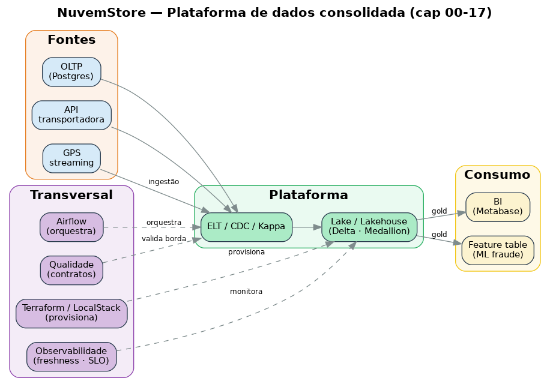

# Runbook — Capítulo 17: capstone de consolidação

> Guia rápido. Status atual: **🟢 consolidação** — este capítulo não sobe ambiente próprio; ele consolida e demonstra os capítulos anteriores. O roteiro de prints está no [GUIDE.md](./GUIDE.md).

## O que este capítulo entrega

A visão macro da plataforma (arquitetura consolidada no [README.md](./README.md) e em [`diagrams/architecture.py`](./diagrams/architecture.py)) e uma **galeria de provas** em [`assets/`](./assets/): um resultado visível por fase, comprovando que a trilha roda de ponta a ponta.

## Como usar

Este capítulo não tem `docker compose up`. Ele se monta conforme você resolve os capítulos anteriores e captura os resultados.

1. Resolva cada capítulo seguindo seus respectivos RUNBOOK/GUIDE/SOLUTION.
2. Em cada um, capture o print de resultado sugerido (lista no [GUIDE.md](./GUIDE.md)) e salve em `assets/`.
3. Volte aqui e referencie os prints na galeria abaixo.

## Gerar o diagrama de arquitetura

```bash
pip install diagrams
python diagrams/architecture.py   # gera assets/17-arquitetura.png
```

## Galeria de provas

> Preencha conforme capturar. Cada item é a prova de uma fase da plataforma (roteiro completo no GUIDE).

**Arquitetura**

<!--  -->

**Fundação (00–03)**

<!--  -->

**Batch analytics (04–06)**

<!--  -->
<!--  -->

**Operação (07)**

<!--  -->

**Lake e lakehouse (08–10)**

<!--  -->
<!--  -->

**Baixa latência (11–12)**

<!--  -->
<!--  -->

**ML e produção (13–16)**

<!--  -->
<!--  -->
<!--  -->
<!--  -->

## Fim da trilha

Volte ao [README raiz](../README.md) para a visão geral da jornada.
